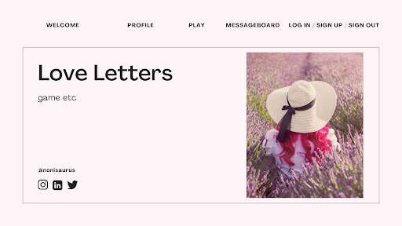
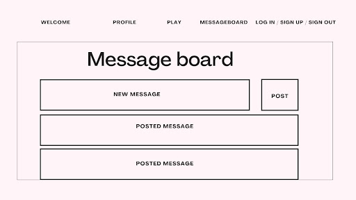
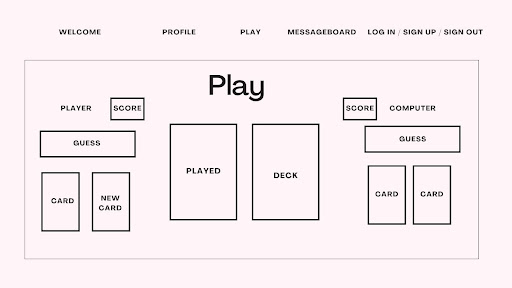
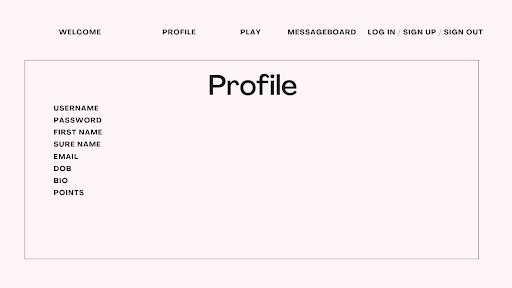
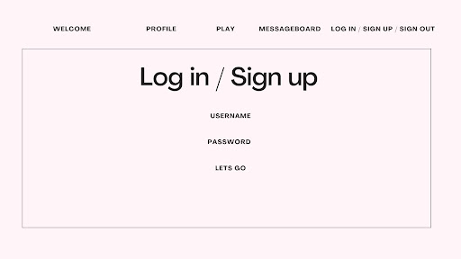
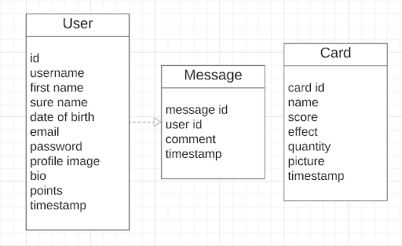

# Love Letters

For this project, I built a full-stack web application using the MERN stack. The application I created serves as a foundation for my future projects and includes features such as user authentication, database management, and basic CRUD functionality. Despite the tight deadline of 7 days, I enjoyed the process of building the application and gained valuable experience.

https://love-letters-frontend.netlify.app/

<br>

## Timeframe

I worked on this project independently with a 7 day timeframe.

<br>

## Technologies Used

Back End:

- Node.js with Express
- MongoDB with Mongoose
- bcrypt
- cors
- jsonwebtoken
- passport
- passport-jwt

<br>

Front End:

- React
- React Router DOM
- axios

<br>

Development Tools:

- lucid.app for ERD
- Canva for wireframes
- Git and GitHub for version control 


<br>

## Brief
- Have at least 2 models (more if it makes sense)
    - Auth is a requirement
- Have full CRUD on at least one of your models
- Be able to Add/Delete on any remaining models
- Have high quality code:
    - Commit often and use meaningful commit messages
    - Document your code well.
    - Follow accepted naming conventions
    - Consistent indentation
    - Well-structured and readable code
    - Semantic naming of variables, functions, CSS classes, etc.
    - Short and clear functions that do one thing
    - Efficient code - if you have your MVP, refactor


<br>

## Planning
For the wireframe, I used Canva to create a basic layout of the user interface (UI) design. I included all the necessary features and functionalities required for the project. This helped me to visualise the final product and make changes to the design as necessary.

Next, I created an Entity Relationship Diagram (ERD) to map out the database schema for the project. This allowed me to identify the different entities, their relationships, and the attributes required for each entity.

Once the planning was done, I began to work on the backend of the project. I used Node.js and Express.js to create the backend API, which would serve data to the front end. I also used MongoDB to store and manage the data. 

After the backend was complete, I moved on to the front end. I used React.js to create an interactive UI.

To manage the project, I used a notebook to write down my initial thoughts. I used Github to manage code changes on the project.









<br>

## Build Process
I made sure to document my project process so I could understand it better in the future, and I think I succeeded in doing so. This was the first project that I genuinely enjoyed working on without constantly doubting myself. Though I did encounter errors and some tasks took longer than expected, I still found the experience enjoyable. My time frame of seven days just flew by. There were definitely times where I had to refer back to my notes to remember what I was doing, even after only a few days of working on the project. It was pretty complex with a lot of different parts, but luckily my notes from the bootcamp I did with General Assembly helped me create a solid foundation for this project.

### **Backend**
**Set up application**
```
npm init  - to generate a package.json file 
touch server.js - to create js file
npm install express --save - to install the Express.js framework 
npm install mongoose --save to install the Mongoose library
```
<br>

**Routes**

<br>

I created routes for index, cards, users, messages then connected them to server.js
```
const indexRouter = require('./routes/index');
const cardsRouter = require('./routes/cards');

app.use(indexRouter);
app.use(cardsRouter);

Set up a MongoDB database connection for my Node.js application
const database = {
    development: `mongodb://localhost:27017/${mongooseBaseName}-development`,
    test: `mongodb://localhost:27017/${mongooseBaseName}-test`
  };

const localDB = process.env.TESTENV ? database.test : database.development;

const currentDB = process.env.MONGODB_URI || localDB;
```

<br>

**Model**

<br>

I decided to have 3 models. One for the users, one for the cards and one for the messages. There is full CRUD on the user and the message models.

<br>

**Authentication**

<br> 

I used the Passport JWT strategy for Node.js authentication. 
npm install cors  - -save to control which domains are allowed to access their APIs and prevent unauthorised access to sensitive data
```
npm install bcrypt for hashing
npm install jsonwebtoken for generating the encoded token
npm install passport for handling requests
npm install passport-jwt for telling passport how to handle JWTs
```

Set up options for extracting and verifying JWTs in requests to a Node.js server.
```
const jwtOptions = {};
jwtOptions.jwtFromRequest = ExtractJwt.fromAuthHeaderAsBearerToken();
jwtOptions.secretOrKey = 'LOVE_LETTERS_SECRET_KEY'
module.exports = jwtOptions;
```
Established a JSON Web Token authentication strategy for a user login system. JWT payload is checked to see if it has a matching user ID in the MongoDB database. If a user with the matching ID is found, the next function is called with the user object as the second argument. If there is no match, the next function is called with false.
```
const strategy = new JwtStrategy(jwtOptions, (jwtPayLoad, next) => {
    if (User.findById(jwtPayLoad.id)) {
        next(null, User.findById(jwtPayLoad.id, true));
    } else {
        next(null, false);
    }
});
```
Implemented authentication and login functionality where I defined two routes for login and logout, and a protected route that can only be accessed with a valid JSON Web Token.

Then added authentication to routes.
```
passport.authenticate('jwt', { session: false })
```

<br>


### **Frontend**
**Set up application**
```
npx create-react-app love-letters-app to create the app
npm install axios --save to be able to use axios
npm install react-router-dom to be able to use reactrouter
```

<br>

**apiConfig.js**

<br>

This code checks whether the application is being accessed from a local development server or a remote production server.

<br>

**Signup**

<br>

I created a function that checks if the username exists in a database and creates a new user if it doesn't exist and the username and password meet the length requirements. It displays error messages if the username already exists or if the username and password are not long enough.
```
  handleSignUp = () => {
    if (this.state.username.length > 0 ) {
      getUserByUsername(this.state.username)
      .then((response) => {
        if(response.data.user.username) {
            if(this.state.username.length >= 6) {
                this.setState({
                    signUpMessage: "Username already exists! Please try another."
                })
            }
        }
      })
      .catch((error) => {
        if(this.state.username.length >= 6 && this.state.password.length >= 6) {
          createUser(this.state.username, this.state.password)      
          .then((response) => {
              this.setState({
                  signUpMessage: "Sign up successful!",
                  username: '',
                  password: ''
              })
              this.props.onSignUpSuccess()
          })
      } else {
          this.setState({
              signUpMessage: "Username and password need to be at least 8 characters."
          })
      }
      })
    }
  }
```
<br>

**Signin**

<br>

The way to log the user in by sending a request to a login endpoint with a username and password. If successful, it saves the user's token and ID in local storage and triggers a callback function.
```
  handleSignin = () => {
    logInRoute(this.state.username, this.state.password)
        .then((response) => {
          console.log('handlesignin response', response)
            localStorage.setItem("jwt", response.token);
            localStorage.setItem("user", response.userId);
            this.props.userSignedIn()
            this.setState({
              username: '',
              password: '',
              signInMessage: 'Successful sign in'
            })
        })
        .catch((error) => {
            console.log('handlesignin error', error);
        });
  }
```
<br>

**Signout**

<br>

To log out the user, this code sends a request to a logout endpoint with the user's ID obtained from local storage, and if successful, it clears the local storage and triggers a callback function to indicate the user is signed out.
```
 logOut = (event) => {
        logOutRoute(localStorage.getItem('user'))
        .then((response) => {
            window.localStorage.clear();
            this.props.userSignedOut()
        })
    }
```
<br>

**Editing profile/user**

<br>

I created two versions of the same component: an edit version and a show version. I used an API call and an onClick function to implement the toggling between the two versions. This allowed me to display a form for editing the component's content and then display the updated content in the show version.

<br>

**Deleting profile/user**

<br>

To delete the user's data, I retrieved their ID  and used it to delete their record from the database. Then, I updated the authentication state and cleared the local storage before redirecting them to the welcome page.
```
export const deleteCardById= (id) => {
    return axios.get(`${apiUrl}/api/cards/${id}`)
}


    deleteProfile = () => {
        const userId = localStorage.getItem('user')
        deleteUserById(userId)
        .then((response) => {
            localStorage.removeItem('user')
            localStorage.removeItem('username')
            localStorage.removeItem('jwt')
            this.props.userSignedOut()
        })
        .catch(e => console.log(`error: DELETE PROFILE >>> ${e}`))
    }
```
<br>

**Message board**

<br>

- Created a state in App.js for all the messages.
- Created a function that will re render this state in App.js.
- Imported API calls and used componentDidMount lifecycle method to display all the messages in MessageBoard.js. I then passed the response data to the messages state through the setMessages() function. This way, the state will be re-rendered to display either the new messages and the saved ones when the page loads.
- Created a variable and used a loop to iterate over the messages stored in the state. Within the loop, I passed the required data as props to the Message component, which displays each message. Finally, I returned the variable containing the messages if the length of the messages state was greater than 0. Otherwise, I displayed a message indicating that there were no messages to display.
- Created a function to delete a message using the deleteMessageById API call. Within this function, I filtered the current messages state to remove the message with the given ID, and updated the state using the setMessages function to re-render the updated list of messages without the deleted message. Passed the deleteMessage function as a prop to the Message component, allowing users to delete messages by clicking a button within each message.
- Created a form to allow users to submit new messages through the PostNewMessage component using the createMessage API call. Within the handleSubmit function, I checked if the message input was not empty, and if so, created a new message object with the necessary data and added it to the beginning of the current messages state using the setMessages function.
- The "Save" button triggers updateMessage, which sends a PUT request to the server to update the message with the new comment. On success, the new comment is displayed and stored in the Message component state, otherwise an error is logged to the console.
- And with that I created a full CRUD on the Message Model.


<br>

## Challenges
- I kept getting this error while I was trying to connect to MongoDB
```
error: MongoNetworkError: connect ECONNREFUSED ::1:27017 
```
I went through my code for a while and I could not detect any issues. So I reached out to stackoverflow where I found that the following command that solved the connection issue: 
brew install mongodb-community-shell
This command installed the MongoDB Community Edition shell, which is a command-line interface for interacting with MongoDB instances.

<br>

- When I was setting up my routes I encountered a problem with the delete method. I could not use .remove(). The terminal kept logging that it is not a function so after some digging I had to use .deleteOne()

<br>

- I faced challenges with authentication, particularly with making API calls. To overcome this, I dedicated a separate file for handling these calls and implemented JSON Web Tokens for added security. However, I encountered difficulty due to a short expiration time and ultimately made adjustments to address this issue.

<br>

- I created a login function that sends a request to the server and receives a response object containing a token and userId upon successful authentication. To improve data accessibility across the application, I also included the username in the response object. However I am not sure how safe this approach is.
```
localStorage.setItem("jwt", response.token);
localStorage.setItem("user", response.userId);
localStorage.setItem("username", response.username);
```

<br>

 - I was struggling for way too long trying to update comments on the message board. Turns out, I was just forgetting to send back the actual data alongside the comment’s id and userId. It felt as if the updating part of CRUD was the most challenging because of all the moving pieces. 

```
export const updateMesageById = (id, comment) => {
					This one word took away hours of my time… :’)
    const updateMessage = {id, userId: `${localStorage.getItem("user")}`, comment}
    return axios.put(`${apiUrl}/api/messages/${id}`, updateMessage,
    {headers: {
        Authorization: `Bearer ${localStorage.getItem("jwt")}`}
    })
}
```

After figuring this out I realised I don't need to do anything else after making the API call. The message got updated on the backend and the frontend as a state, and even if they weren't connected right away, it still shows the same thing without refreshing the page.


<br>

## Wins
I was able to lay the foundation for an app, which I hope to develop further in the near future.

Despite struggling with authentication, I am proud to say that I eventually managed to implement it successfully. While there is definitely room for improvement, I am excited to continue learning and exploring this topic further.


<br>

## Key Learnings
During this project, I gained a lot of knowledge about the fundamentals of Node.js and authentication. However, I acknowledge that there is still much for me to learn, and I would like to deepen my understanding by practising more.


<br>

## Bugs
Once the JWT token expires (after 100 minutes), the authentication ceases to function. Therefore, to perform any actions, signing out and signing back in again is required. 
This could be resolved with a refresh token as it is long-lived and can be used to obtain new access tokens without requiring the user to log in again.


<br>

## Future Improvements

My project has a basic design with minimal styling, as my main focus was on its functionality. Despite its simplicity, I believe it will serve as a solid foundation for my upcoming project, which I am eager to continue building. 

I am looking forward to giving it more styling and to  build the actual card game that this project is named after, as it is one of my favourite games. 

Also I would like to spend some time implementing the refresh token function. 

Last but not least I forgot to change the input field’s type to password so everyone can see what you are typing oops.
